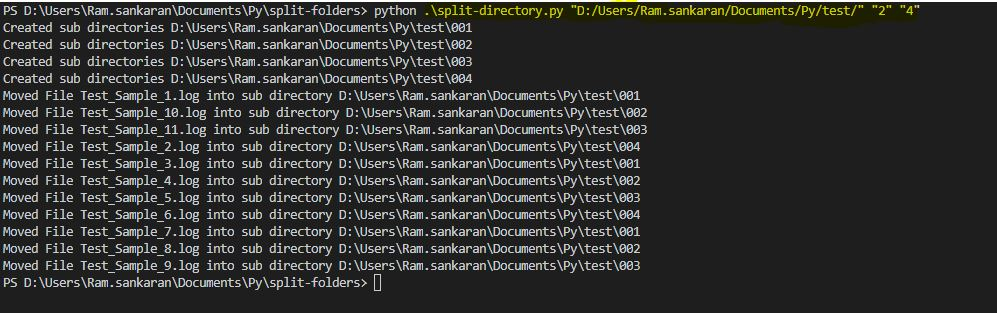

# Overview

This script helps to spilt a folder /directory with large number of files into sub-directories/ folders.

# Prerequisite 
    Python

# Running

## arguments
        <absolete_directory_path>  <split_option> <fixed_value>
        
## split option

1. Based on fix number of sub directories 
    (say if number of sub directories is fixed at 5, then the files present will be equally distributed among them)
    
2. Based on files to be placed in each sub directory
    (Say if files to be in each directory is fixed at 5, then sub-directories will be created accordingly)

## usage

